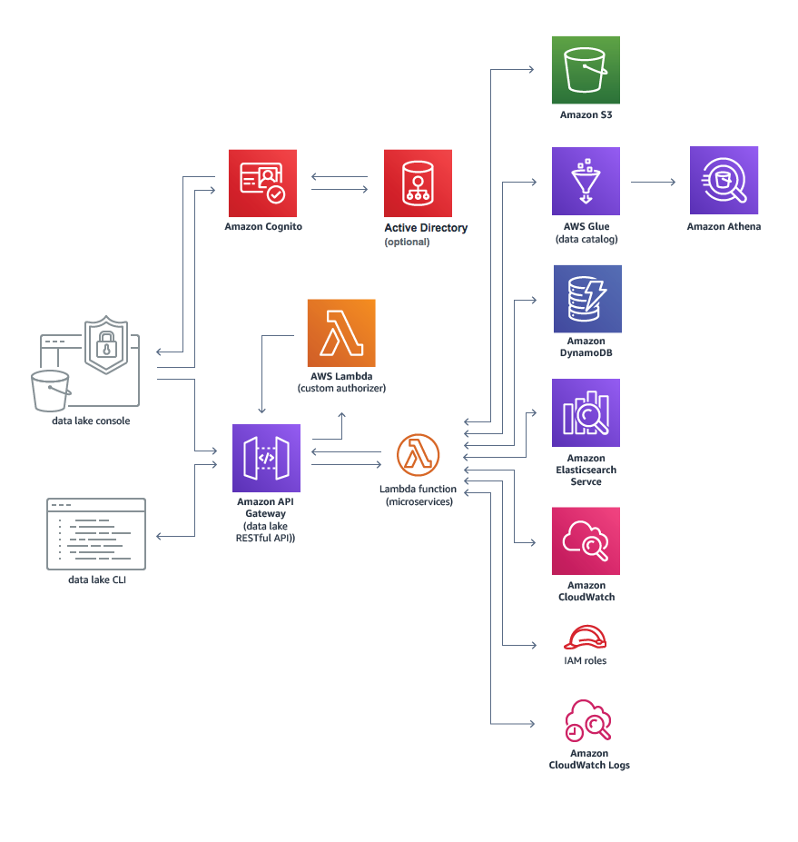

# 数据工程

## 概述

机器学习领域都是围绕着数据而开展的。借由干净的数据，我们能够对业务开展更深层次的分析，从而主动制定业务决策，而不是被动反应，帮助我们更深入了解客户。

## 内容

### 1. 数据库存储

- AWS S3
    - 一种面向 Internet 的存储服务。您可以通过 Amazon S3 随时在 Web 上的任何位置存储和检索的任意大小的数据。您可以通过简单直观的 Web 界面管理控制台完成这些任务
    - 将数据存储为存储桶中的数据元。对象是一个文件或任何描述该文件的可选元数据

- 数据湖 DataLake
    - 数据湖是一个集中式存储库，允许您以任意规模存储所有结构化和非结构化数据。您可以按原样存储数据（无需先对数据进行结构化处理），并运行不同类型的分析 – 从控制面板和可视化到大数据处理、实时分析和机器学习，以指导做出更好的决策。
    - 基本要素

        - **数据移动** 数据湖允许您导入任何数量的实时获得的数据。您可以从多个来源收集数据，并以其原始形式将其移入到数据湖中。此过程允许您扩展到任何规模的数据，同时节省定义数据结构、Schema 和转换的时间。

        - **安全地存储和编目数据** 数据湖允许您存储关系数据和非关系数据。它们还使您能够通过对数据进行爬网、编目和建立索引来了解湖中的数据。最后，必须保护数据以确保您的数据资产受到保护。

        - **分析** 数据湖允许组织中的各种角色通过各自选择的分析工具和框架来访问数据。这包括 Apache Hadoop、Presto 和 Apache Spark 等开源框架，以及数据仓库和商业智能供应商提供的商业产品。数据湖允许您运行分析，而无需将数据移至单独的分析系统。

        - **机器学习** 数据湖将允许组织生成不同类型的见解，包括报告历史数据以及进行机器学习，并建议一系列规定的行动以实现最佳结果。

    - 架构图
    
        

### 2. 数据提取解决方案

- 批处理 AWS Batch

- 流处理 AWS Kinesis Data Stream

    

### 3. 数据转换方案

## 参考文档链接

- AWS S3 介绍 [https://docs.aws.amazon.com/zh_cn/AmazonS3/latest/gsg/GetStartedWithS3.html](https://docs.aws.amazon.com/zh_cn/AmazonS3/latest/gsg/GetStartedWithS3.html)

- AWS DataLake 解决方案 [https://docs.aws.amazon.com/zh_cn/solutions/latest/data-lake-solution/welcome.html](https://docs.aws.amazon.com/zh_cn/solutions/latest/data-lake-solution/welcome.html)

- AWS Batch [https://docs.aws.amazon.com/batch/latest/userguide/what-is-batch.html](https://docs.aws.amazon.com/batch/latest/userguide/what-is-batch.html)

- AWS Kinesis Data Stream [https://docs.aws.amazon.com/streams/latest/dev/introduction.html](https://docs.aws.amazon.com/streams/latest/dev/introduction.html)